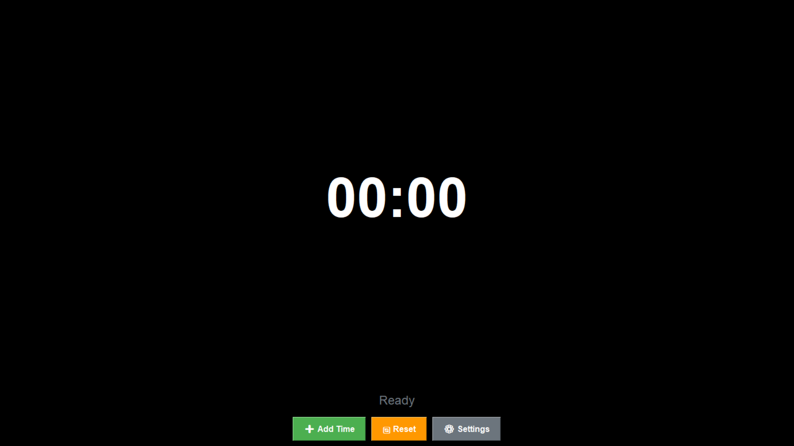

⏱️ Fullscreen Timer Application
A full-featured, fullscreen timer application built with Python and Tkinter, designed for computer rental shops or time-limited usage scenarios. Features PIN-protected time extension, system lockdown when time expires, and customizable time options.

 

✨ Features
🕒 Fullscreen Timer Display - Clean, large digital clock interface

🔒 PIN Protection - Secure PIN system for adding time and accessing settings

⏰ Flexible Time Options - Pre-set time packages and custom time input

🔊 Audio Notifications - Sound alerts for 5-minute warning and time expiration

🛡️ System Lockdown - Fullscreen lock when time expires with shutdown countdown

⌨️ Keyboard Blocking - Prevents unauthorized exit or system access

🎨 Customizable UI - Toggle between fullscreen and windowed modes

💰 Business Ready - Built-in pricing display (5 pesos for 25 minutes, 10 pesos for 50 minutes)

🚀 Installation
Prerequisites
Python 3.6 or higher

Required packages: pygame, keyboard
