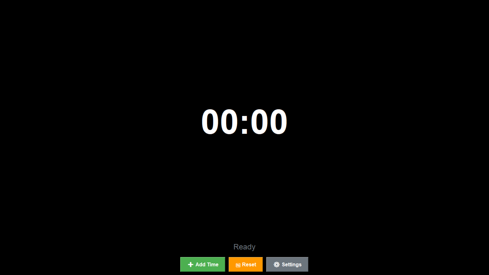

 

# Timer v2.2 — Local CyberCafé Timer & Management Dashboard

> **Version:** v2.2  
> **Description:** Final local-only dashboard with Happy Time, Money to Time, custom-date transactions, profit tracking, Telegram remote control, fullscreen timer, and automatic backups.

---

## Table of Contents

- [Overview](#overview)
- [What the Application Does](#what-the-application-does)
- [Architecture](#architecture)
- [Main Features](#main-features)
  - [Fullscreen Timer](#1-fullscreen-timer)
  - [Time Sales](#2-time-sales)
  - [Happy Time](#3-happy-time)
  - [Money to Time](#4-money-to-time)
  - [Open Time](#5-open-time)
  - [Time Deduction](#6-time-deduction)
  - [Profit Tracking](#7-profit-tracking)
  - [Transactions](#8-transactions)
  - [Web Management Dashboard](#9-web-management-dashboard)
  - [Telegram Remote Control](#10-telegram-remote-control)
  - [Promotional Packages](#11-promotional-packages)
  - [Notifications](#12-notifications)
  - [Screenshots](#13-screenshots)
  - [Restart and Shutdown](#14-restart-and-shutdown)
  - [Security](#15-security)
  - [Network Discovery](#16-network-discovery)
  - [Automatic Backups](#17-automatic-backups)
  - [State Restoration](#18-state-restoration)
  - [Sound and Fullscreen Controls](#19-sound-and-fullscreen-controls)
- [Default Configuration](#default-configuration)
- [Data Files](#data-files)
- [Installation](#installation)
- [First-Time Setup](#first-time-setup)
- [Running the Application](#running-the-application)
- [Web Dashboard](#web-dashboard)
- [Telegram Setup](#telegram-setup)
- [Telegram Commands](#telegram-commands)
- [Dashboard/API Endpoints](#dashboardapi-endpoints)
- [How Pricing Works](#how-pricing-works)
- [How Profit Tracking Works](#how-profit-tracking-works)
- [Backup and Recovery](#backup-and-recovery)
- [Security Notes](#security-notes)
- [Windows Notes](#windows-notes)
- [Troubleshooting](#troubleshooting)
- [Project Limitations](#project-limitations)
- [Suggested Project Structure](#suggested-project-structure)
- [Quick Start](#quick-start)

---

# Overview

Timer v2.2 is a **Windows-oriented local cybercafé/computer-rental timer application**.

It combines:

1. A fullscreen countdown timer displayed on the customer computer.
2. A local HTTP server on port `8080`.
3. A browser-based management dashboard.
4. Local JSON-based profit and configuration storage.
5. Telegram remote management.
6. Time packages, promotions, free/Happy Time, and Money-to-Time conversion.
7. Transaction history and CSV export.
8. Daily profit analytics and an earnings calendar.
9. Automatic daily backups.
10. Timer state restoration after restart.

The application is designed around a **single local computer** in its current dashboard implementation. Older network-discovery/group-management code remains in the source, but the current dashboard intentionally reports the local computer only.

---

# What the Application Does

A typical cybercafé workflow is:

```text
Customer rents a computer
        |
        v
Staff adds paid time
        |
        v
Timer starts / existing timer increases
        |
        v
Customer uses the computer
        |
        +--------------------+
        |                    |
        v                    v
   5-minute warning       Time expires
        |                    |
        v                    v
 Warning sound          Timeout handling
        |
        v
Staff can add more time,
deduct time, reset, or use Open Time
        |
        v
Payment is recorded
        |
        v
Profit dashboard updates
        |
        v
Transaction is available
for history / CSV export
```

---

# Architecture

The application is a single Python program.

```text
v2.2.py
│
├── Tkinter
│   └── Fullscreen customer timer
│
├── Pygame / Mixer
│   └── Timer warning and timeout sounds
│
├── Local HTTP Server
│   ├── Customer/staff web interface
│   └── Management dashboard
│
├── JSON Storage
│   ├── config.json
│   ├── profit_data.json
│   └── chat_ids.json
│
├── Telegram Bot
│   └── Remote management
│
├── Network Discovery
│   └── Legacy/compatibility functionality
│
└── Backup System
    └── backups/*.zip
```

The application starts the fullscreen UI, web server, network discovery, backup scheduler, and Telegram bot when configured.

---

# Main Features

## 1. Fullscreen Timer

The main customer-facing interface runs in fullscreen mode.

### Capabilities

- Fullscreen timer display
- Countdown timer
- Open Time mode
- Timer status display
- Remaining-time display
- Warning sounds
- Timeout sounds
- Warning notifications
- Prevents normal window closing
- Can block several Windows shortcut keys

The application blocks:

```text
Windows key
Win
Left Windows
Right Windows
Menu
Alt + Tab
Alt + F4
Ctrl + Esc
```

This is useful for preventing customers from escaping the timer application.

---

## 2. Time Sales

Staff can add time to a computer.

Supported input styles include:

### Minutes

```text
30 minutes
60 minutes
120 minutes
```

### Custom time

```text
Hours
Minutes
Seconds
```

For example:

```text
1 hour
30 minutes
15 seconds
```

The web interface also provides quick time buttons.

---

## 3. Happy Time

**Happy Time** adds free time without treating it as paid revenue.

Example:

```text
Customer rents 2 hours
Staff wants to give 30 bonus minutes

Happy Time:
+30 minutes
₱0 revenue
```

Telegram example:

```text
/happytime 30
```

The application uses `record_profit=False` for Happy Time operations.

### Important

Happy Time is different from a paid transaction because the time is provided for free.

---

## 4. Money to Time

Money to Time allows the operator to enter an amount of money and have the application convert it into time using the configured pricing/rate.

Example concept:

```text
Customer gives: ₱50

Configured rate:
₱0.25 / minute

Result:
200 minutes
```

The exact result depends on the current configuration and pricing logic.

Telegram command:

```text
/moneytime
```

The bot asks for the money amount and applies the calculated time.

---

## 5. Open Time

Open Time is a mode where the computer is used without a countdown limit.

### Start

```text
Open Time → Start
```

### Stop

```text
Open Time → Stop
```

The application tracks elapsed time.

Open Time cannot be started while a countdown timer is running. The countdown must be reset first.

Telegram:

```text
/opentime start
/opentime stop
```

The web dashboard also has a Start/Stop Open Time button.

---

## 6. Time Deduction

Staff can remove time from a running countdown.

Example:

```text
Current:
2 hours remaining

Deduct:
30 minutes

Result:
1 hour 30 minutes remaining
```

Telegram:

```text
/deduct 30
```

The application prevents deduction when:

- The timer is not running.
- Open Time is active.
- There is insufficient remaining time.

---

## 7. Profit Tracking

The application stores financial transactions locally in:

```text
profit_data.json
```

Each transaction contains:

```json
{
  "timestamp": "UTC timestamp",
  "computer_ip": "computer IP",
  "minutes": 60,
  "amount": 15,
  "payment_method": "cash"
}
```

The system maintains:

- Total profit
- Daily profit
- Weekly profit
- Monthly profit
- Yearly profit
- All-time profit
- Computer earnings
- Transaction history
- Best-performing days

---

## 8. Transactions

Transaction history can be viewed by period.

Supported periods include:

- Today
- This week
- This month
- All transactions
- Custom date

A transaction includes:

| Field | Description |
|---|---|
| Timestamp | Transaction time |
| Computer IP | Local computer identifier |
| Minutes | Time sold |
| Amount | Amount recorded |
| Payment Method | Cash, promo, free, etc. |

### Custom Date

Telegram can request transactions for a specific date:

```text
YYYY-MM-DD
```

Example:

```text
2026-08-01
```

The bot displays the transactions for that date and calculates the total number of transactions and total amount.

---

# 9. Web Management Dashboard

The application includes a browser-based dashboard.

Default server port:

```text
8080
```

The dashboard includes:

### Authentication

- Dashboard PIN
- Session cookies
- CSRF tokens
- Session timeout
- Authentication rate limiting

### Timer Controls

- Add time
- Custom time
- Reset timer
- Start Open Time
- Stop Open Time
- Current timer status
- Remaining time

### Pricing

- Quick time packages
- Custom time pricing preview
- Configurable per-minute rate

### Financial Dashboard

- Today's profit
- Weekly profit
- Monthly profit
- Yearly profit
- All-time profit
- Recent transactions
- Best days

### Analytics

- Daily earnings bar chart
- Earnings calendar
- Monthly navigation
- Best days list

### Export

CSV exports are available for:

```text
Today
Week
Month
All
```

The CSV contains:

```text
Timestamp (UTC)
Computer IP
Minutes
Amount (PHP)
Payment Method
```

---

# 10. Telegram Remote Control

The application can optionally run a Telegram bot.

If a Telegram token exists in `config.json`, the application starts the bot automatically.

Telegram is useful for managing the computer remotely.

The main Telegram menu includes:

```text
📊 Status
⏳ Add Time
⏱️ Deduct Time
⏱️ Open Time
💰 Profit
📸 Screenshot
📜 Transactions
🖥️ Computers
✅ Ready
🔄 Reset
⚙️ Settings
🎁 Promo
🎉 Happy Time
💰 Money to Time
📨 Notify
🔁 Restart
⏹️ Shutdown
```

The bot also saves authorized/used chat IDs in:

```text
chat_ids.json
```

---

# 11. Promotional Packages

The default configuration contains:

### 4+1

```text
4 hours + 1 hour free
Total: 300 minutes
Price: ₱48
```

### 6+2

```text
6 hours + 2 hours free
Total: 480 minutes
Price: ₱72
```

Promotions are recorded with:

```text
payment_method = promo
```

The promotion system can be configured through the application's configuration.

---

# 12. Notifications

The application can display popup notifications on the computer.

Notifications:

- Appear near the top-right of the screen.
- Fade in.
- Remain visible for a configurable display period.
- Fade out.

Telegram can send a custom notification:

```text
/notify Your message here
```

Example:

```text
/notify Customer at Computer 1, please proceed to the counter.
```

---

# 13. Screenshots

Telegram can request a screenshot of the computer.

Command:

```text
/screenshot
```

The application:

1. Captures the screen.
2. Converts the screenshot to JPEG.
3. Sends the image through Telegram.

This is useful for remote monitoring.

---

# 14. Restart and Shutdown

The Telegram bot provides:

```text
/restart
```

and:

```text
/shutdown
```

These invoke Windows system commands.

### Restart

```text
shutdown /r /t 1
```

### Shutdown

```text
shutdown /s /t 1
```

**Use these commands carefully.**

---

# 15. Security

The application includes several security mechanisms.

## Password/PIN hashing

PINs are hashed using:

```text
PBKDF2-HMAC-SHA256
```

with:

```text
100,000 iterations
```

and random salts.

## Dashboard sessions

Successful authentication creates:

- Session token
- CSRF token

Sessions expire after:

```text
1 hour
```

of inactivity.

## CSRF protection

Protected POST operations require an `X-CSRF-Token`.

## Rate limiting

Authentication and protected operations use rate limiting.

Default:

```text
10 requests
per 60 seconds
per IP
```

## Local-only default

The web server defaults to:

```text
127.0.0.1:8080
```

This means it normally listens only on the same computer.

---

# 16. Network Discovery

The source contains a network-discovery subsystem.

It scans the local `/24` network and checks computers using:

```text
/status
/network_info
```

The discovery code can identify:

- Computer name
- IP address
- Online/offline status
- Remaining time
- Running state
- Last-seen time

However, the **current dashboard is intentionally local-only** and returns the local computer rather than presenting a multi-computer management dashboard.

There are also legacy classes for:

- Computer groups
- Gaming Zone
- Regular Zone
- VIP Zone
- Bulk operations

These remain in the source for compatibility but are not the main current dashboard workflow.

---

# 17. Automatic Backups

The application automatically schedules a backup every day around midnight.

Backups are stored in:

```text
backups/
```

Example:

```text
backups/
├── backup_20260809_000000.zip
├── backup_20260810_000000.zip
└── ...
```

The backup contains:

```text
config.json
profit_data.json
```

The application keeps the newest **7 backup ZIP files** and removes older ones.

When Telegram is active, a backup completion notification is sent.

---

# 18. State Restoration

The timer stores its current state so it can restore an active countdown after restarting.

The source includes restoration handling for countdown state.

If a valid countdown remains, the application restores the timer and logs a restoration event.

This helps avoid losing active customer time because of an application restart.

---

# 19. Sound and Fullscreen Controls

The application supports:

### Sound

```text
Enable Sound
Disable Sound
```

### Display

```text
Fullscreen Mode
Windowed Mode
```

Timer warnings and timeout sounds are handled through Pygame's mixer.

---

# Default Configuration

When no configuration exists, the application creates:

```text
config.json
```

The important defaults are:

| Setting | Default |
|---|---:|
| Open rate | ₱0.25/minute |
| Device name | Computer hostname |
| Shop name | My CyberCafé |
| Web port | 8080 |
| Bind address | 127.0.0.1 |

Default time options:

| Minutes | Price |
|---:|---:|
| 5 | ₱0 |
| 20 | ₱5 |
| 40 | ₱10 |
| 60 | ₱15 |
| 80 | ₱20 |
| 120 | ₱30 |

Default promotions:

| Promotion | Minutes | Price |
|---|---:|---:|
| 4+1 | 300 | ₱48 |
| 6+2 | 480 | ₱72 |

---

# Data Files

The application can create these files:

```text
config.json
profit_data.json
chat_ids.json
backups/
```

## config.json

Contains:

- Hashed PIN
- Dashboard PIN hash
- Salts
- Pricing rate
- Telegram token
- Device name
- Shop name
- Time options
- Promo options
- Web bind address

## profit_data.json

Contains:

- Total profit
- Daily profit
- Transactions
- Computer earnings
- Restoration events

## chat_ids.json

Contains Telegram chat IDs used by the bot.

## backups/

Contains daily ZIP backups.

---

# Installation

## Requirements

The source imports these third-party Python packages:

```text
pygame
keyboard
requests
Pillow
python-telegram-bot
```

The application also uses Python standard-library modules such as:

```text
tkinter
datetime
threading
socket
json
http.server
urllib
asyncio
logging
csv
zipfile
glob
hashlib
hmac
subprocess
```

### Important

The source file does **not** include a pinned `requirements.txt` or an explicitly documented Python version.

For a Windows installation, Python 3.10+ is a reasonable starting point, but the exact supported Python version should be tested against the installed dependency versions.

---

# Installation on Windows

## 1. Install Python

Install Python 3.10 or newer.

During installation, enable:

```text
Add Python to PATH
```

Verify:

```powershell
python --version
```

and:

```powershell
pip --version
```

---

## 2. Create a Project Folder

Example:

```text
C:\CyberCafeTimer\
```

Put:

```text
v2.2.py
```

inside the folder.

---

## 3. Create a Virtual Environment

Recommended:

```powershell
cd C:\CyberCafeTimer
python -m venv .venv
```

Activate it:

```powershell
.venv\Scripts\activate
```

You should see something similar to:

```text
(.venv) C:\CyberCafeTimer>
```

---

## 4. Install Python Dependencies

Run:

```powershell
python -m pip install --upgrade pip
python -m pip install pygame keyboard requests Pillow python-telegram-bot
```

### Tkinter

On standard Windows Python installations, Tkinter is normally included.

Test it with:

```powershell
python -m tkinter
```

If a small Tk window opens, Tkinter is working.

---

# First-Time Setup

After installing dependencies, run:

```powershell
python v2.2.py
```

The application will create configuration/data files as needed.

The main application starts with:

```text
Fullscreen timer
+
Local web server
+
Profit tracker
+
Network discovery
+
Daily backup scheduler
+
Optional Telegram bot
```

---

# Running the Application

From the project directory:

```powershell
python v2.2.py
```

Or, with the virtual environment:

```powershell
.venv\Scripts\activate
python v2.2.py
```

---

# Web Dashboard

The web server uses:

```text
Port: 8080
Bind: 127.0.0.1
```

Therefore the default local address is:

```text
http://127.0.0.1:8080/
```

The dashboard is:

```text
http://127.0.0.1:8080/dashboard
```

The main web page also provides an **Open Management Dashboard** button.

---

# Dashboard Authentication

The dashboard requires a Dashboard PIN.

Authentication flow:

```text
Browser
   |
   v
Enter Dashboard PIN
   |
   v
POST /auth
   |
   v
PIN verification
   |
   v
Session token + CSRF token
   |
   v
Dashboard access
```

The session is stored using an HTTP cookie:

```text
session=<token>
```

The session timeout is:

```text
3600 seconds
```

or:

```text
1 hour
```

---

# Telegram Setup

Telegram is optional.

The application reads the Telegram token from:

```text
config.json
```

Field:

```json
{
  "telegram_token": "YOUR_BOT_TOKEN"
}
```

If the token is empty:

```json
{
  "telegram_token": ""
}
```

the Telegram bot does not start.

If a token is present, the application starts the Telegram bot automatically.

---

## Creating a Telegram Bot

Use Telegram's official bot creation process to create a bot and obtain its token.

Then place the token into:

```text
config.json
```

Example:

```json
{
  "telegram_token": "123456789:YOUR_TOKEN_HERE"
}
```

Do not publish your bot token in a public GitHub repository.

---

# Telegram Commands

| Command | Purpose |
|---|---|
| `/start` | Start bot interaction |
| `/menu` | Open main menu |
| `/help` | Show help |
| `/status` | Show current status |
| `/addtime 30` | Add 30 minutes |
| `/opentime start` | Start Open Time |
| `/opentime stop` | Stop Open Time |
| `/reset` | Reset timer |
| `/profit` | Show profit summary |
| `/computers` | Show local computer |
| `/ready` | Check whether computer is ready |
| `/restart` | Restart Windows |
| `/shutdown` | Shut down Windows |
| `/notify message` | Show a notification |
| `/deduct 30` | Deduct 30 minutes |
| `/history` | Open transaction history |
| `/transactions` | Open transaction history |
| `/screenshot` | Send a screenshot |
| `/happytime 30` | Add 30 free minutes |
| `/moneytime` | Convert money into time |

---

# Telegram Settings

The Settings menu supports:

### Change PIN

```text
New PIN
```

Minimum:

```text
4 characters
```

### Change Open Rate

Example:

```text
0.25
```

Meaning:

```text
₱0.25 per minute
```

### Change Device Name

Example:

```text
Computer-1
```

### Change Shop Name

Example:

```text
My CyberCafé
```

### Change Time Options

The bot accepts a JSON list.

Example:

```json
[
  {"minutes":5,"price":0},
  {"minutes":20,"price":5},
  {"minutes":40,"price":10},
  {"minutes":60,"price":15},
  {"minutes":120,"price":30}
]
```

Each option requires:

```text
minutes
price
```

Minutes must be positive and prices cannot be negative.

---

# Dashboard/API Endpoints

The built-in HTTP server exposes these routes.

## Public / Basic

| Method | Endpoint | Purpose |
|---|---|---|
| GET | `/` | Main web interface |
| GET | `/status` | Current timer status |
| GET | `/network_info` | Computer/network information |
| GET | `/calculate_price` | Calculate price for minutes |

## Authentication

| Method | Endpoint | Purpose |
|---|---|---|
| POST | `/auth` | Authenticate Dashboard PIN |
| GET | `/logout` | End dashboard session |

## Protected Timer Controls

| Method | Endpoint | Purpose |
|---|---|---|
| POST | `/add_time` | Add time |
| POST | `/reset` | Reset timer |
| POST | `/opentime/start` | Start Open Time |
| POST | `/opentime/stop` | Stop Open Time |

Protected POST operations require a valid session and CSRF token.

## Dashboard Data

| Method | Endpoint | Purpose |
|---|---|---|
| GET | `/profit_data` | Profit analytics |
| GET | `/computers_data` | Local computer data |
| GET | `/chart_data` | Daily chart data |
| GET | `/monthly_earnings` | Earnings by month |
| GET | `/computer_transactions` | Local computer transactions |
| GET | `/export_transactions` | CSV export |

---

# How Pricing Works

The application first checks whether an exact configured time option exists.

Example:

```text
60 minutes
```

If the configuration contains:

```json
{
  "minutes": 60,
  "price": 15
}
```

the price is:

```text
₱15
```

If there is no exact matching package, the application calculates:

```text
minutes × open_rate_per_minute
```

Example:

```text
90 minutes × ₱0.25
= ₱22.50
```

---

# How Profit Tracking Works

When a paid transaction is created:

```text
Transaction
    |
    +--> Timestamp
    +--> Computer IP
    +--> Minutes
    +--> Amount
    +--> Payment Method
    |
    v
profit_data.json
```

The amount is added to:

```text
Total Profit
Daily Profit
Computer Earnings
Transaction History
```

The dashboard then calculates:

```text
Today
This Week
This Month
This Year
All Time
```

---

# Payment Methods

The source supports transaction payment-method labels such as:

```text
cash
promo
free
```

The default normal paid-time operation uses:

```text
cash
```

Promotions use:

```text
promo
```

Happy Time/free time can use:

```text
free
```

---

# Backup and Recovery

## Automatic Backup

At approximately midnight, the application creates:

```text
backups/backup_YYYYMMDD_HHMMSS.zip
```

Example:

```text
backup_20260810_000000.zip
```

The ZIP contains:

```text
config.json
profit_data.json
```

The system keeps up to:

```text
7 backups
```

---

## Manual Recovery

To recover configuration/profit data:

1. Close the application.
2. Find the desired backup ZIP.
3. Extract it.
4. Replace:
   - `config.json`
   - `profit_data.json`
5. Start the application again.

**Always make a copy of the current files before replacing them.**

---

# Security Notes

## Do Not Expose the Default Server Publicly

The default bind address is:

```text
127.0.0.1
```

This is intentionally local.

Do not change it to:

```text
0.0.0.0
```

unless you understand the security implications and have properly secured the network.

## Protect Your Telegram Token

Never commit:

```text
config.json
```

with your real Telegram bot token to GitHub.

## Protect Your Data Files

Do not publish:

```text
config.json
profit_data.json
chat_ids.json
```

if they contain private information or secrets.

---

# Windows Notes

This application is strongly oriented toward Windows.

The source directly invokes Windows commands:

```text
shutdown /r /t 1
shutdown /s /t 1
```

It also blocks Windows keyboard shortcuts.

Therefore, Windows is the recommended operating system.

---

# Troubleshooting

## `ModuleNotFoundError: No module named 'pygame'`

Run:

```powershell
python -m pip install pygame
```

---

## `ModuleNotFoundError: No module named 'keyboard'`

Run:

```powershell
python -m pip install keyboard
```

---

## `ModuleNotFoundError: No module named 'requests'`

Run:

```powershell
python -m pip install requests
```

---

## `ModuleNotFoundError: No module named 'PIL'`

Install Pillow:

```powershell
python -m pip install Pillow
```

The package is installed as `Pillow` but imported as:

```python
from PIL import ImageGrab
```

---

## `ModuleNotFoundError: No module named 'telegram'`

Install:

```powershell
python -m pip install python-telegram-bot
```

---

## Tkinter is missing

Test:

```powershell
python -m tkinter
```

If it fails, install/use a standard Python Windows distribution that includes Tk/Tcl.

---

## Dashboard Does Not Open

Check that the application is running.

Then open:

```text
http://127.0.0.1:8080/
```

or:

```text
http://127.0.0.1:8080/dashboard
```

Also check whether another application is already using port `8080`.

---

## Telegram Bot Does Not Start

Check:

```text
config.json
```

and make sure:

```json
{
  "telegram_token": "YOUR_REAL_BOT_TOKEN"
}
```

is populated.

If the token is empty, the application intentionally does not start the Telegram bot.

---

## Timer Does Not Allow Alt+Tab / Windows Key

This is intentional.

The application blocks:

```text
Windows
Alt+Tab
Alt+F4
Ctrl+Esc
```

This behavior is designed for customer/kiosk-style use.

---

## I Want to Close the Application

The source prevents normal window closing.

Use the application's intended controls or stop the Python process from an administrative/maintenance session.

Be careful not to terminate the application while a customer timer is active unless you have verified that state restoration is working as expected.

---

# Project Limitations

The following points are important when deploying this version.

## 1. Local JSON Storage

The application uses JSON files instead of MySQL/PostgreSQL/SQLite.

This is simple and portable but is not ideal for very large installations.

## 2. Current Dashboard Is Local-Computer Focused

Although network discovery and computer-group classes exist in the source, the current dashboard endpoints intentionally return the local computer.

## 3. No Requirements File Included

The source does not ship with a pinned `requirements.txt`.

Create one for reproducible deployment after testing your chosen dependency versions.

Example:

```text
pygame
keyboard
requests
Pillow
python-telegram-bot
```

## 4. Chart.js Uses a CDN

The dashboard loads Chart.js from:

```text
https://cdn.jsdelivr.net/npm/chart.js
```

Therefore, the dashboard's chart functionality requires access to that CDN unless Chart.js is changed to a local copy.

## 5. No Installer/EXE Is Included

The supplied source is a Python application.

It is not currently an `.exe` installer.

You run it with:

```powershell
python v2.2.py
```

---

# Suggested Project Structure

After first launch, a typical deployment can look like:

```text
CyberCafeTimer/
│
├── v2.2.py
├── config.json
├── profit_data.json
├── chat_ids.json
│
├── backups/
│   ├── backup_YYYYMMDD_HHMMSS.zip
│   ├── backup_YYYYMMDD_HHMMSS.zip
│   └── ...
│
└── .venv/
```

Optional deployment files you may add:

```text
requirements.txt
README.md
.gitignore
start.bat
```

---

# Recommended `.gitignore`

If you publish the project on GitHub, use a `.gitignore` similar to:

```gitignore
# Python
__pycache__/
*.py[cod]
*.pyo

# Virtual environment
.venv/
venv/
env/

# Application secrets/data
config.json
chat_ids.json
profit_data.json

# Backups
backups/

# IDE
.vscode/
.idea/

# OS
Thumbs.db
.DS_Store
```

Do **not** commit real Telegram tokens or private business transaction data.

---

# Recommended `requirements.txt`

The supplied source does not contain a pinned requirements file. Based on its imports, a starting requirements file is:

```text
pygame
keyboard
requests
Pillow
python-telegram-bot
```

After testing a deployment, pin the exact versions you used:

```text
package==x.y.z
```

This makes future installations more reproducible.

---

# Quick Start

## Windows

```powershell
mkdir C:\CyberCafeTimer
cd C:\CyberCafeTimer
```

Copy:

```text
v2.2.py
```

into the folder.

Create the environment:

```powershell
python -m venv .venv
```

Activate it:

```powershell
.venv\Scripts\activate
```

Install dependencies:

```powershell
python -m pip install --upgrade pip
python -m pip install pygame keyboard requests Pillow python-telegram-bot
```

Run:

```powershell
python v2.2.py
```

Open the dashboard:

```text
http://127.0.0.1:8080/dashboard
```

---

# Operational Example

A normal customer session could look like this:

```text
1. Start v2.2.py
       |
       v
2. Fullscreen timer starts
       |
       v
3. Customer buys 1 hour
       |
       v
4. Staff adds 60 minutes
       |
       v
5. Transaction is recorded
       |
       v
6. Timer counts down
       |
       v
7. Warning occurs near timeout
       |
       v
8. Customer buys another package
       |
       v
9. Staff adds more time
       |
       v
10. Profit totals update
       |
       v
11. Transaction appears in history
       |
       v
12. Staff can export the records
       |
       v
13. Daily backup protects configuration
       and profit records
```

---

# Feature Summary

| Feature | Available |
|---|---|
| Fullscreen timer | Yes |
| Countdown timer | Yes |
| Open Time | Yes |
| Add time | Yes |
| Custom hours/minutes/seconds | Yes |
| Deduct time | Yes |
| Happy Time | Yes |
| Money to Time | Yes |
| Promo packages | Yes |
| Profit tracking | Yes |
| Daily profit | Yes |
| Weekly profit | Yes |
| Monthly profit | Yes |
| Yearly profit | Yes |
| All-time profit | Yes |
| Transaction history | Yes |
| Custom-date transaction lookup | Yes |
| CSV export | Yes |
| Daily profit chart | Yes |
| Earnings calendar | Yes |
| Best days | Yes |
| Telegram control | Optional |
| Telegram screenshot | Yes |
| Telegram notifications | Yes |
| Remote restart | Yes |
| Remote shutdown | Yes |
| PIN authentication | Yes |
| Hashed PINs | Yes |
| Session timeout | Yes |
| CSRF protection | Yes |
| Rate limiting | Yes |
| Automatic backups | Yes |
| State restoration | Yes |
| Sound controls | Yes |
| Fullscreen/windowed controls | Yes |
| Network discovery code | Included |
| Multi-computer dashboard | Not the current dashboard workflow |
| SQL database | No |
| EXE installer | No |
| Built-in requirements.txt | No |

---

# Version Information

```text
Application:
Timer v2.2

Version description:
FINAL LOCAL-ONLY DASHBOARD
No Pie Chart
Happy Time
Money to Time
Custom Day Transactions
```

---

# Source Notes

This README documents the supplied `v2.2.py` source.

Where the source explicitly defines a feature, this README describes that implementation.

Where installation details are not explicitly included in the source (such as the exact Python version or pinned dependency versions), this README marks them as recommendations rather than claiming they are officially specified by the application.

